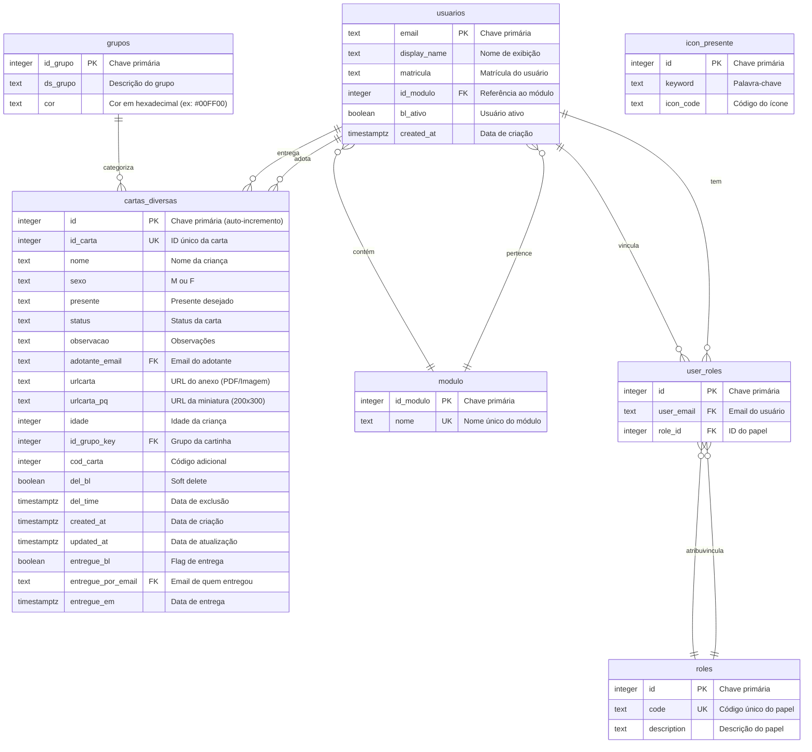

# Diagrama de Entidade-Relacionamento (ER)

Diagrama completo do banco de dados do sistema Noel-R utilizando Mermaid.js.

## Legenda

- **PK**: Primary Key (Chave Primária)
- **FK**: Foreign Key (Chave Estrangeira)
- **UK**: Unique Key (Chave Única)
- **||--o{**: Relacionamento Um-para-Muitos
- **}o--||**: Relacionamento Muitos-para-Um

## Descrição dos Relacionamentos

1. **usuarios ↔ modulo**: Um usuário pertence a um módulo (opcional). Um módulo pode ter muitos usuários.
2. **usuarios ↔ cartas_diversas (adota)**: Um usuário pode adotar muitas cartinhas. Uma cartinha pode ter um adotante (opcional).
3. **usuarios ↔ cartas_diversas (entrega)**: Um usuário (admin) pode marcar muitas cartinhas como entregues. Uma cartinha pode ser entregue por um usuário.
4. **grupos ↔ cartas_diversas**: Um grupo pode ter muitas cartinhas. Uma cartinha pertence a um grupo (opcional).
5. **usuarios ↔ user_roles ↔ roles**: Sistema RBAC (Role-Based Access Control). Um usuário pode ter muitos papéis através da tabela de associação `user_roles`.

## Índices Principais

- `idx_cartas_status`: Índice no campo `status` da tabela `cartas_diversas`
- `idx_cartas_adotante`: Índice no campo `adotante_email` da tabela `cartas_diversas`
- `idx_cartas_delbl`: Índice no campo `del_bl` da tabela `cartas_diversas`
- `idx_cartas_entregue`: Índice no campo `entregue_bl` da tabela `cartas_diversas`

## Constraints

- **ck_cartas_sexo**: Check constraint que garante que o campo `sexo` em `cartas_diversas` seja apenas 'M' ou 'F'
- **uq_user_role**: Unique constraint em `user_roles` para evitar duplicação de pares (user_email, role_id)

